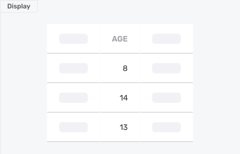
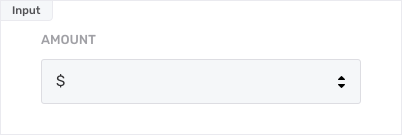
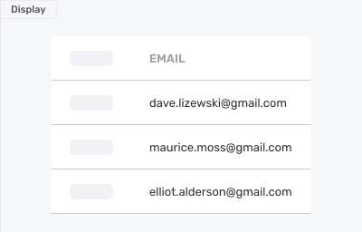
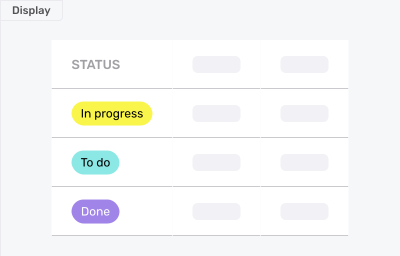
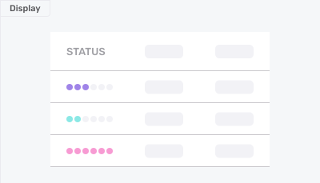

# Add properties to an entity

Properties are the characteristics of your [entities](entities). For example, a **Product** can have properties like `name`, `description`, `price`...

## Syntax

You can add the properties to your entities in the [backend.yml file](manifest-file)

```yaml
name: Blog about cats
entities:
  📝 Post:
    properties:
      - name # Short syntax for string type.
      - { name: content, type: text } # Property type specified.
      - { name: publishedAt, type: date }
      - { name: authorEmail, type: email, hidden: true } # Extra options.
```

## Property params

You can pass arguments to the `@Prop()` decorator:

| Option      | Default  | Type       | Description                                                             |
| ----------- | -------- | ---------- | ----------------------------------------------------------------------- |
| **type**    | "string" | _PropType_ | The [Property type](#property-types) (text, number, email, location...) |
| **hidden**  | `false`  | boolean    | If the property should be hidden in the API response                    |
| **options** | {}       | Object     | Specific options depending on **type**                                  |

## Property types {#property-types}

Each property has a **type** that represents real-world usages. Some of them have specific options.

### String

A simple string.

```yaml
- { name: firstName, type: string }

# Short syntax, same as above.
- firstName
```

<div class="show-result">


  <div class="is-hidden-desktop"> 
    
    
  </div>
</div>

---

### Textarea

Textarea field for medium-size texts.

```yaml
- { name: description, type: text }
```

<div class="show-result">


  <div class="is-hidden-desktop"> 
    
    
  </div>
</div>

### Number

A numerical value.

```yaml
- { name: age, type: number }
```

<div class="show-result">


  <div class="is-hidden-desktop"> 
    
    
  </div>
</div>

---

### Link

An URL that links to an external page.

```yaml
- { name: website, type: link }
```

<div class="show-result">


  <div class="is-hidden-desktop"> 
    
    
  </div>
</div>

---

### Money

A money field with a currency.

```yaml
- { name: price, type: money, options: { currency: 'EUR' } }
```

<div class="show-result">


  <div class="is-hidden-desktop"> 
    
    
  </div>
</div>

##### Parameters

| Option       | Default | Type   | Description                                                                                      |
| ------------ | ------- | ------ | ------------------------------------------------------------------------------------------------ |
| **currency** | _USD_   | string | [ISO 4217 currency code](https://en.wikipedia.org/wiki/ISO_4217#List_of_ISO_4217_currency_codes) |

---

### Date

Basic date field.

```yaml
- { name: startDate, type: date }
```

<div class="show-result">


  <div class="is-hidden-desktop"> 
    
    
  </div>
</div>

---

### Email

```yaml
- { name: email, type: email }
```

<div class="show-result">


  <div class="is-hidden-desktop"> 
    
    
  </div>
</div>

---

### Boolean

For any field with a "true or false" value.

```yaml
- { name: isActive, type: boolean }
```

<div class="show-result">


  <div class="is-hidden-desktop"> 
    
    
  </div>
</div>

---

### Password

Password field.

```yaml
- { name: password, type: password }
```


:::danger

You should never ever store a password on clear text.

:::

### Choice

A given choice of options.

```yaml
- { name: sex, type: choice, options: { values: [male, female] } }

# Sequential if the values are ordered in a logical sense..
- {
    name: status,
    type: choice,
    options: { values: [draft, submitted, published], sequential: true }
  }
```

##### Display: 'label'

<div class="show-result">


  <div class="is-hidden-desktop"> 
    
    
  </div>
</div>

##### Display: 'progress-bar'

<div class="show-result">


  <div class="is-hidden-desktop"> 
    
    
  </div>
</div>

##### Parameters

| Option         | Default   | Type     | Description                                            |
| -------------- | --------- | -------- | ------------------------------------------------------ |
| **values**     | _(empty)_ | String[] | An array of strings representing the available choices |
| **sequential** | `false`   | boolean  | Specifies if the values are ordered in a logical sense |

### Location

The location type consists in a object with `lat` and `lng` coordinates.

```yaml
- { name: location, type: location }
```
