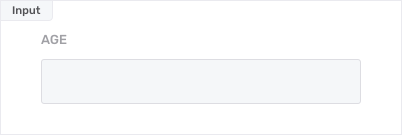
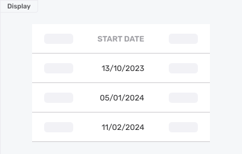
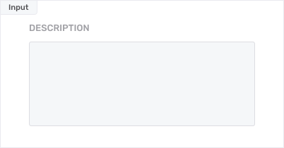
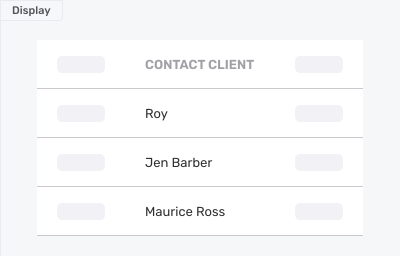
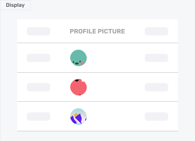
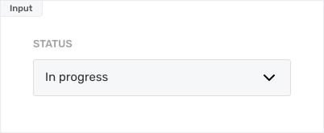

# Property types

CASE works with it's own set of types that corresponds to different types of data often used in CRUD apps.

Each **PropType** corresponds to a set of different logic, display, format and options.

---

### Text

A simple text field.

```js
  @Prop({
    type: PropType.Text
  })
  name: string
```

<div class="show-result">


  <div class="is-hidden-desktop"> 
    
    
  </div>
</div>

---

### Number

A numerical value.

```js
  @Prop({
    type: PropType.Number
  })
  memberCount: number
```

<div class="show-result">


  <div class="is-hidden-desktop"> 
    
    
  </div>
</div>

---

### Link

An URL that links to an external page.

```js
  @Prop({
    type: PropType.Link
  })
  website: string
```

<div class="show-result">


  <div class="is-hidden-desktop"> 
    
    
  </div>
</div>

---

### Currency

Choose from any currency.

```js
  @Prop({
    type: PropType.Currency,
    options: {
      currency: 'EUR'
    }
  })
  amount: number

```

<div class="show-result">


  <div class="is-hidden-desktop"> 
    
    
  </div>
</div>

##### Parameters

| Option       | Default | Type   | Description                                                                                      |
| ------------ | ------- | ------ | ------------------------------------------------------------------------------------------------ |
| **currency** | _USD_   | string | [ISO 4217 currency code](https://en.wikipedia.org/wiki/ISO_4217#List_of_ISO_4217_currency_codes) |

---

### Date

Basic date field.

```js
  @Prop({
    type: PropType.Date
  })
  date: Date
```

<div class="show-result">


  <div class="is-hidden-desktop"> 
    
    
  </div>
</div>

---

### Textarea

Textarea field for medium size texts.

```js
  @Prop({
    type: PropType.Textarea
  })
  description: string
```

<div class="show-result">


  <div class="is-hidden-desktop"> 
    
    
  </div>
</div>

---

### Email

Classic email input.

```js
  @Prop({
    type: PropType.Email
  })
  email: string
```

<div class="show-result">


  <div class="is-hidden-desktop"> 
    
    
  </div>
</div>

---

### Boolean

For any field with a "true or false" value.

```js
  @Prop({
    label: 'Is the user active ?',
    type: PropType.Boolean,
  })
  isActive: boolean
```

<div class="show-result">


  <div class="is-hidden-desktop"> 
    
    
  </div>
</div>

---

### Relation

A relationship with another entity.

For the Relation type, you just need to pass the related entity class to the `options.entity` param like:

```js
@Prop({
  label: 'Owner of the cat',
  type: PropType.Relation,
  options: {
    entity: Owner
  }
})
owner: Owner
```

<div class="show-result">


  <div class="is-hidden-desktop"> 
    
    
  </div>
</div>

| Option                     | Default | Type    | Description                                                                                                                                               |
| -------------------------- | ------- | ------- | --------------------------------------------------------------------------------------------------------------------------------------------------------- |
| **entity<span >\*</span>** | -       | string  | The Entity class of the parent                                                                                                                            |
| **eager**                  | false   | boolean | If true, the relation will be loaded automatically. Otherwise you need to [explicitly request the relation](connect.md?id=crud-operations) in the client. |

<br/>
> [!NOTE]
>
> - CASE Relations only work in the **Children => Parent** direction on many-to-one relationships.
> - When you use **cascade delete** and delete the _Owner_ record, it will also delete all his or her _Cat_ records

<br/>

---

### Password

Hidden password field.

```js
  @Prop({
    type: PropType.Password,
    options: {
     isHiddenInAdminList: true,
    }
  })
  password: string
```


> [!ATTENTION]
> You should never ever store a password on clear text.
> You can use the [@BeforeInsert hook](hooks.md#beforeinsert) to encrypt it.
> To prevent selecting it, use [property options](properties.md?id=options) as above

---

### File

File upload input.

```js
  @Prop({
    type: PropType.File
  })
  certificate: string
```

<div class="show-result">


  <div class="is-hidden-desktop"> 
    
    
  </div>
</div>

---

### Image

Same as file but for images.

```js
  @Prop({
    type: PropType.Image
  })
  image: JSON
```

<div class="show-result">


  <div class="is-hidden-desktop"> 
    
    
  </div>
</div>

| Option    | Default             | Type   | Description                                                                 |
| --------- | ------------------- | ------ | --------------------------------------------------------------------------- |
| **sizes** | _80x80 and 800x800_ | object | File sizes generated [when uploading an image](storage.md?id=Upload images) |

---

### Enum

The Enum type allows users to choose from a set of constants that you define, like a multiple choice question. It takes a [TS String enum](https://www.typescriptlang.org/docs/handbook/enums.html#string-enums) as option.

```js
  import { ProjectStatus } from '../enums/project-status.enum.ts'

   @Prop({
    label: 'Status',
    type: PropType.Enum,
    options: {
      enum: ProjectStatus,
      display: 'progress-bar'
    }
  })
  status: string
```

```js
// enums/project-status.enum.ts
export enum ProjectStatus {
  Pending = 'Pending',
  Signed = 'Signed',
  WorkInProgress = 'Work in progress',
  Inactive = 'Inactive',
  Archived = 'Archived',
}
```

##### Display: 'label'

<div class="show-result">


  <div class="is-hidden-desktop"> 
    
    
  </div>
</div>

##### Display: 'progress-bar'

<div class="show-result">


  <div class="is-hidden-desktop"> 
    
    
  </div>
</div>

##### Parameters

| Option      | Default | Type                          | Description                                                                                                    |
| ----------- | ------- | ----------------------------- | -------------------------------------------------------------------------------------------------------------- |
| **enum**    | -       | enum                          | [String enum](https://www.typescriptlang.org/docs/handbook/enums.html#string-enums) with the available options |
| **display** | 'label' | 'label' &#124; 'progress-bar' | Enum props can be represented either by a label or by a progress bar if the enum follows a logic order.        |

### Location

The location type consists in a object with `lat` and `lng` coordinates.

```js
  @Prop({
    type: PropType.Location,
  })
  location: JSON
```
